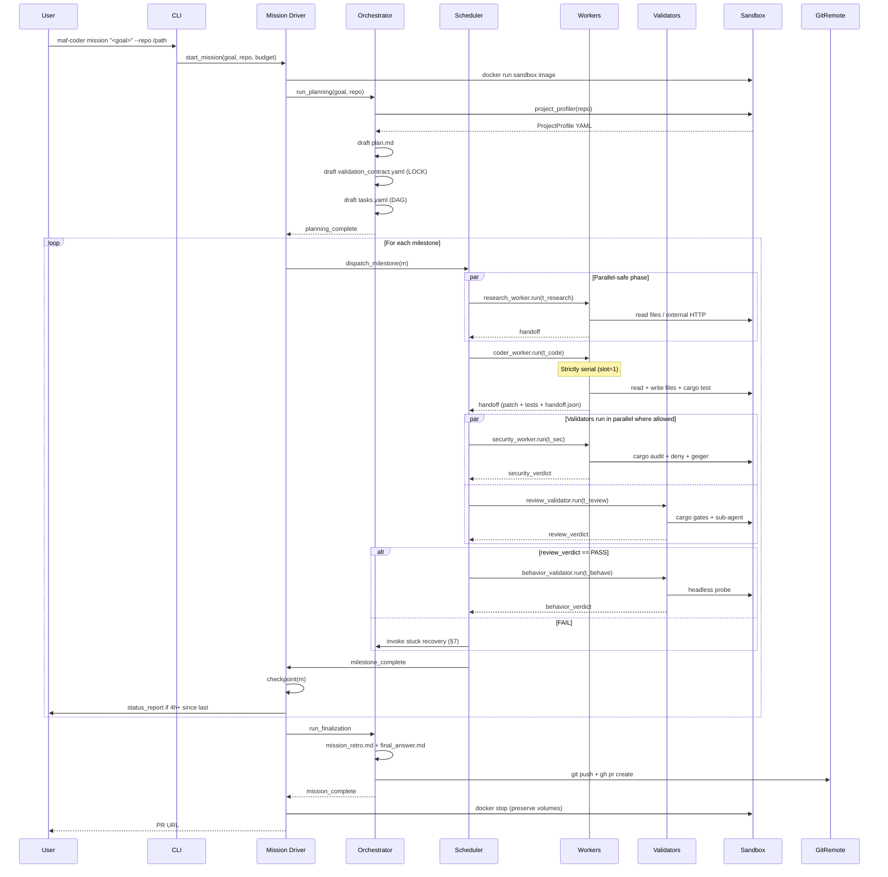
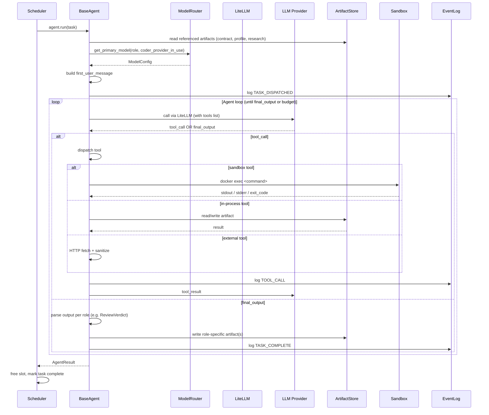

# MAF-Coder Architecture (v1)

> System-level design document for the MAF-Coder framework. Companion to:
> - `agent_team_soul_v3.1.md` — organizational rules (the "why")
> - `MAF-Coder_v2_Build_Plan.md` — phased delivery (the "when")
> - `prompts/*.md` — agent behavior contracts (the "how each agent thinks")
>
> This document covers **system shape** — components, communication, lifecycles, failure handling. It is implementation-language-agnostic in form but assumes Python 3.11+ with OpenAI Agents SDK + LiteLLM (decision §16-D1).
>
> Concrete function signatures, tool schemas, and API contracts are in **`AGENT_TOOLS_SPEC.md`** (separate document).
> Concrete worked example with sample artifacts at every step is in **`WORKED_EXAMPLE.md`** (separate document).

---

## 0. How to read this document

| Reader | Suggested reading order |
|---|---|
| Cursor / Claude Code building Phase B+ | §1 → §2 → §3 → §4 → §10. Refer back to §15 when questions arise. |
| Human reviewer | §0 → §11 (out of scope) → §15 (design decisions) → §1 → §2 → ... |
| Operations / debugging a stuck mission | §6 → §7 → §15 |

**Notation conventions used throughout:**

- `ArtifactStore`, `EventLog`, `ModelRouter` — refer to existing classes in `src/maf_coder/`
- *Worker*, *Validator*, *Orchestrator* (italic) — refer to agent roles per soul.md §3
- `mission_id`, `task_id`, `milestone_id` — identifiers; format defined in §3.4
- 异-provider — soul.md term: "different LLM provider from Coder" (the validator constraint)
- "Phase B / C / D / E / F / G" — refer to Build Plan §Phase A through G

**This document is normative for v1.** Conflicts with prose elsewhere should resolve in this direction: `soul.md` (constitution) > `ARCHITECTURE.md` (this) > `prompts/*` > everything else. If you find a conflict, file an issue rather than picking arbitrarily.

---

## 1. System context

### What MAF-Coder is

A multi-agent framework that takes (user goal, target Rust git repository, budget) and produces (Pull Request, validation evidence, cost record). It runs **autonomously for hours to days**, with human steering via four channels: status reports (push), user_messages inbox (pull), Human Gate (escalation), PR review (final).

### What MAF-Coder is NOT

- An IDE plugin or interactive coding assistant
- A real-time pair-programming agent
- A hosted SaaS — v1 runs locally on a single machine
- A general-purpose coding agent — v1 targets Rust projects (lib / CLI / service / embedded / wasm) per soul.md §6
- A replacement for human review — every mission ends with a PR that a human must approve

### External boundary

```
┌─────────────────────────────────────────────────────────────┐
│                                                             │
│   User (you, via CLI + status reports + inbox + PR review)  │
│                                                             │
└────┬─────────────────────────────────────────────────┬──────┘
     │                                                 │
     ▼                                                 ▼
┌─────────────────┐                          ┌──────────────────┐
│  MAF-Coder      │  LiteLLM HTTP API calls  │  LLM providers   │
│  host process   │ ───────────────────────▶ │  (Anthropic,     │
│  (Python 3.11+) │ ◀─────────────────────── │   OpenAI,        │
│                 │                          │   Google)        │
└────┬────────────┘                          └──────────────────┘
     │
     │ docker exec /
     │ docker run
     ▼
┌─────────────────┐
│  Per-mission    │  HTTPS to crates.io,     ┌──────────────────┐
│  Docker sandbox │  docs.rs, GitHub,         │  External web    │
│  (Rust toolchain│ ────────────────────────▶│  (crates.io,     │
│   + tools)      │  filtered by sanitizer    │   docs.rs, etc.) │
└────┬────────────┘                          └──────────────────┘
     │
     │ git push / gh pr create
     ▼
┌─────────────────┐
│  Git remote     │
│  (GitHub /      │
│   GitLab)       │
└─────────────────┘
```

Inside the dotted boundary, MAF-Coder owns the entire execution. Outside is human + service surface; never assume control.

---

## 2. Top-level topology

### Process layout

**One host Python process per mission.** Hosts:
- The Orchestrator agent (Python object, async)
- All Worker / Validator agents (Python objects, async)
- The scheduler (in-memory DAG executor)
- The blackboard layer (ArtifactStore + EventLog backed by filesystem)
- The model router (ModelRouter wrapping LiteLLM)
- Communication clients to: LLM providers (HTTPS), Docker daemon (Unix socket), git remote (HTTPS / SSH via git CLI)

**One Docker sandbox container per mission**, long-running (mission duration). Hosts:
- The git worktree (`/workspace/<repo>`)
- The Rust toolchain + cargo-* tools
- The C toolchain, protoc, wasm-pack, security scanners
- Persistent volumes for cargo cache, target cache, sccache

The host process talks to the container via `docker exec` for every command an agent issues. No process or daemon runs *inside* the container besides per-command tool processes.

### Component map

```
┌────────────────────────────────────────────────────────────────────┐
│                       Host Python process                          │
│                                                                    │
│  ┌──────────────┐    ┌──────────────┐    ┌─────────────────────┐  │
│  │     CLI      │───▶│   Mission    │───▶│   Orchestrator      │  │
│  │  (typer)     │    │  Lifecycle   │    │      Agent          │  │
│  │              │    │    Driver    │    │  (BaseAgent + role) │  │
│  └──────────────┘    └──────┬───────┘    └──────────┬──────────┘  │
│                             │                       │             │
│                             ▼                       ▼             │
│                      ┌──────────────┐    ┌─────────────────────┐  │
│                      │  Scheduler   │◀──▶│      Worker /       │  │
│                      │   (DAG +     │    │  Validator agents   │  │
│                      │   slot lock) │    │  (BaseAgent each)   │  │
│                      └──────┬───────┘    └──────────┬──────────┘  │
│                             │                       │             │
│        ┌────────────────────┴───────────────────────┘             │
│        │                                                          │
│        ▼                                                          │
│  ┌─────────────┐  ┌─────────────┐  ┌──────────────┐  ┌──────────┐ │
│  │ ArtifactStore│  │  EventLog  │  │ ModelRouter  │  │  Sandbox │ │
│  │             │  │            │  │              │  │   Client │ │
│  └─────────────┘  └────────────┘  └──────────────┘  └────┬─────┘ │
│                                                          │       │
└──────────────────────────────────────────────────────────┼───────┘
                                                           │
                       docker exec                         │
                                                           ▼
┌────────────────────────────────────────────────────────────────────┐
│                  Per-mission Docker container                      │
│  /workspace/<repo>  ← bind mount (host) or volume (container-only) │
│  /cargo-cache       ← persistent docker volume                     │
│  /target-cache      ← persistent docker volume                     │
│  /sccache           ← persistent docker volume                     │
│  /missions          ← bind mount to host                           │
│                                                                    │
│  Tools available: cargo, clippy, fmt, audit, deny, geiger,         │
│                   nextest, expand, wasm-pack, gitleaks, gh, git    │
└────────────────────────────────────────────────────────────────────┘
```

### Why one container per mission, not per task

Three reasons compose to this decision (see §15-D2 for full rationale):

1. **target/ persistence.** Multi-day missions retry, resume, and re-validate constantly. Discarding the Rust target/ between tasks costs 3-10 minutes per recompile — fatal for a 16-day mission.
2. **State survival across checkpoint resume.** When resume kicks in, we restore the container snapshot, not rebuild it. One container = one snapshot lineage.
3. **Simplicity.** Per-task containers means orchestrating container lifecycle alongside agent lifecycle. Two timelines = more bugs.

---

## 3. Execution model

### Async throughout

All agent and tool code is `async def`. The CLI entry points wrap with `asyncio.run()`. There are no synchronous workers in v1.

**Rationale**: OpenAI Agents SDK is async-first. LiteLLM is async-first. Docker SDK has good async wrappers via `aiodocker`. Mixing sync and async creates impedance mismatches at the boundaries. Pick one — async — and stay there.

### Single mission, single host process

A mission runs in one Python process. There is no inter-process orchestration in v1.

**Multi-process is in scope only when**: (a) we cross a security boundary (we don't — Docker provides that), or (b) we need to scale across machines (we don't — single-user, single-machine v1). Neither applies. KISS.

### State model

| State category | Where it lives | Persistence | Survives across |
|---|---|---|---|
| Mission configuration (goal, profile, contract, plan, tasks) | Filesystem via ArtifactStore | Permanent | Process restart |
| Mission progress (events, current_milestone, cumulative cost) | Filesystem via EventLog + mission_state.json | Permanent | Process restart |
| Active task slots (which worker is running now) | In-memory (scheduler) | Volatile | NOT process restart — resume rebuilds from disk |
| Agent LLM context (the agent's conversation history) | In-memory (Agent instance) | Volatile | NOT process restart — agents are stateless across runs; resume starts a new conversation per task |
| Code worktree (the actual Rust source) | Filesystem via git | Permanent | Process restart; checkpoint resume restores via git tag |
| target/ build cache | Docker volume | Permanent | Process restart, mission restart |

**Key invariant**: every fact relevant to mission progress is on disk. The scheduler and agents are reconstructible from the blackboard. This is what makes resume possible (§6.3).

### The Agent abstraction

Every agent role (Orchestrator, Research Worker, Coder Worker, Security Worker, ReviewValidator, BehaviorValidator) shares one base class: **`BaseAgent`**.

`BaseAgent` provides:
- `instructions` loaded from `prompts/<role>.md`
- Model selected via `ModelRouter.get_primary_model(role, coder_provider_in_use=...)` with fallback chain
- A list of tools registered for the role (per `permission.allowed_tools` in the task spec)
- A `run(task: Task, ...) -> AgentResult` async method that:
  1. Constructs the first user message from the task spec + referenced artifacts
  2. Hands control to OpenAI Agents SDK `Runner` with the tools
  3. Loops on tool calls until the agent emits a `final_output` or hits budget
  4. Returns an `AgentResult` (output text, tools used, cost, latency, fallback flag)

Each role is a subclass of `BaseAgent` that:
- Specifies which prompt file to load
- Specifies which tools to register
- Specifies any role-specific output post-processing (e.g., ReviewValidator parses verdict into `ReviewVerdict` schema)

**Diff between roles is small**. Most of the complexity lives in the tools, not the agents.

### Tools = the bridge between agent and the world

A *tool* is a Python async function registered with the agent. When the agent emits a tool call, OpenAI Agents SDK invokes the function and feeds the return value back.

Tools fall into three categories:

1. **In-process tools** (Orchestrator only): operate on the host filesystem via ArtifactStore, on the EventLog, on the scheduler. Example: `dispatch_task`, `read_artifact`, `emit_status_report`.

2. **Sandbox tools** (Workers and Validators): operate inside the Docker container via `docker exec`. Example: `run_cargo_test`, `read_file`, `git_diff`. The tool function constructs a `docker exec` command, runs it, captures stdout/stderr/exit_code, returns to the agent.

3. **External tools** (Research Worker primarily): make outbound HTTP calls, fetch crate metadata, search docs.rs. Each external request passes through a **content sanitizer** before its result is returned to the agent (soul.md §7).

The agent never knows whether a tool runs in-process or in-sandbox. It calls `read_file("src/foo.rs")` and gets back the file's content. The tool implementation handles the dispatch.

**Permission boundaries are enforced at the tool level, not the agent level**. If a Coder task spec says `allowed_paths: ["./src", "./tests"]`, the `write_file` tool function checks that the path is under one of those before executing. If a sandbox tool sees a denied command pattern (e.g., `git push`), it refuses. This is the right layer — it's enforced even if the agent's prompt is somehow subverted.

### The scheduler

A single async coroutine maintained by the Orchestrator. Responsibilities:

1. **Maintain the task DAG**: nodes are `Task` instances; edges are `depends_on` references.
2. **Track active slots**: a `dict[Role, Task | None]` mapping each writable role to its current task. Coder Worker is the only role with a strict 1-slot limit (the soul.md §3.3 write-serial rule).
3. **Dispatch ready tasks**: a task is *ready* if all its `depends_on` are complete AND its slot is free.
4. **Wait for completion**: as worker coroutines complete, the scheduler updates state, frees slots, marks dependents ready.
5. **Enforce budgets**: per-task max_runtime_sec is enforced by `asyncio.wait_for`. Per-task max_tokens / max_retries are enforced by `BaseAgent.run`.

The scheduler is **not** a thread pool or process pool. It's a coordinator that holds `asyncio.Task` references and gates dispatch on slots + deps.

```python
# Pseudocode — actual signatures in AGENT_TOOLS_SPEC.md
async def schedule(self):
    pending = self._tasks_by_id.copy()
    while pending:
        ready = [t for t in pending.values() if self._is_ready(t)]
        if not ready:
            done, _ = await asyncio.wait(self._active, return_when=FIRST_COMPLETED)
            self._handle_completed(done)
            continue
        for t in ready:
            if self._slot_free(t.owner):
                self._active.add(asyncio.create_task(self._run_task(t)))
                self._claim_slot(t.owner, t)
                pending.pop(t.task_id)
```

### Concurrency rules (soul.md §3 enforced here)

| Role | Slot rule | Concurrency |
|---|---|---|
| Orchestrator | Singleton (only one in process) | N/A — it's the scheduler |
| Research Worker | No slot limit | Multiple parallel allowed |
| Coder Worker | **Slot=1, mission-wide** | Strictly serial |
| Security Worker | No slot limit (read-only) | Can run parallel to Coder |
| ReviewValidator | Slot=1 per Coder task being reviewed | Serial relative to its target |
| BehaviorValidator | Slot=1 mission-wide (it executes built artifacts) | Strictly serial, runs only after ReviewValidator PASS |

The single-slot rule for Coder is **not** for compute reasons; it's because two concurrent Coder writes would race on the worktree. The Docker container's filesystem is the contention point.

---

## 4. Mission lifecycle

This is the highest-level flow. Each step expands into per-task execution (§5) and multi-day infrastructure (§6).



**Key invariant in the lifecycle**: planning happens **once** at mission start. The validation contract is locked at the end of planning and not touched again unless Human Gate authorizes a re-plan. This is what gives the rest of the mission a fixed reference for "what does done mean."

---

## 5. Per-task execution

Detail view of what happens when the scheduler dispatches a single task. The shape is the same for every Worker / Validator role; the role-specific differences are which tools are registered.



**Where the prompts come in**: `BaseAgent` loads `prompts/<role>.md` as `instructions=`. The first user message is *not* the prompt — it's the task-specific context. The prompt sets identity + permanent rules + decision trees; the message gives a specific assignment.

**Where the budget comes in**: `Task.budget.max_runtime_sec` wraps the entire `agent.run` call in `asyncio.wait_for`. `Task.budget.max_tokens` is passed into the Agent SDK config. `Task.budget.max_retries` is enforced at the scheduler level — if the agent fails (validator FAIL or exception), retry up to N before escalating per soul.md §5.4.

**Where the异-provider rule kicks in**: when Orchestrator dispatches a ReviewValidator task or any sub-agent, it passes `coder_provider_in_use` (extracted from MissionState) into the agent's router lookup. ModelRouter rejects any model whose provider matches — see Phase A code for the enforcement.

---

## 6. Multi-day infrastructure

The features that distinguish "agent loop that runs for hours" from "agent loop that runs for days."

### 6.1 Status reports

A background async task within the Mission Driver runs every 5 minutes:

```
every 5 minutes:
  if (now - last_status_report) >= 4h:
      build StatusReport from mission_state.json + EventLog
      ArtifactStore.save_status_report(report)
      push notification (configurable channel)
      mission_state.last_status_report_at = now
```

The status report **does not block execution**. The Driver schedules a "report" coroutine; the Orchestrator continues dispatching tasks while the report is being assembled.

Push channels (configured in `~/.maf-coder/config.yaml`):
- Webhook URL (POST JSON of status_report)
- Desktop notification (osx notify / notify-send)
- Email (SMTP)
- CLI `tail` mode (status reports stream to stdout if `maf-coder logs` is running)

### 6.2 Checkpoints

After **every milestone** passes both validators, the Mission Driver creates a checkpoint:

```python
# Pseudocode — full signature in AGENT_TOOLS_SPEC.md
def create_checkpoint(milestone_id: str) -> Checkpoint:
    # 1. Tag git
    git_tag = f"mission/{mission_id}/m{milestone_id}"
    run_in_sandbox(f"git tag {git_tag}")
    
    # 2. Snapshot the container
    snapshot_id = docker_commit(container_id, f"maf-coder-snapshot:{git_tag}")
    
    # 3. Archive artifacts
    archive_path = f"missions/{mission_id}/checkpoints/{milestone_id}/"
    copy_tree(f"missions/{mission_id}/", archive_path, exclude=["checkpoints/"])
    
    # 4. Persist Checkpoint record
    cp = Checkpoint(...)
    artifact_store.save_checkpoint(cp)
    
    # 5. Update mission state
    mission_state.last_checkpoint_at = now
    mission_state.completed_milestones.append(milestone_id)
    
    return cp
```

A checkpoint is three artifacts: a git tag, a Docker image snapshot, and a filesystem archive. Together they let `maf-coder resume <mission_id> --from m<n>` rewind to a known-good state.

### 6.3 Resume

```
maf-coder resume <mission_id> [--from m<n>]
```

Process:

1. Load `mission_state.json` from disk.
2. Identify the target checkpoint (last completed if `--from` omitted; specific if given).
3. Restore the container: `docker run` with the snapshotted image (if checkpoint snapshot exists) OR `docker run` fresh image and `git checkout` the tag.
4. Restore `MissionState` to the checkpoint's state (completed_milestones up to and including target).
5. Hand control to the Mission Driver, which dispatches the next milestone in plan.md.

**The agents do NOT resume their internal state.** They start fresh per-task. This is by design — agent state is non-deterministic and brittle; only artifacts are durable. Resume happens at the *task boundary*, not mid-conversation.

### 6.4 User messages inbox

Polling pattern, not event-driven. At every milestone boundary (before dispatching the next milestone's first task), the Orchestrator:

```
files = list(user_messages/<mission_id>/)
# Process !urgent first, then alphabetical
sorted_files = sorted(files, key=lambda f: (not f.startswith("!urgent"), f.name))
for f in sorted_files:
    process_user_message(f)
    move(f, processed_messages/<mission_id>/)
mission_state.last_user_message_processed_at = now
```

For `!urgent` files, the Orchestrator also polls between individual tasks within a milestone, not just at milestone boundaries.

User messages CAN modify:
- Mission priority / task ordering (via tasks.yaml updates)
- Add risks to risk_register.md
- Trigger immediate status report
- Trigger mission pause / abort

User messages CANNOT modify:
- `validation_contract.yaml` (requires explicit Human Gate)
- Any artifact directly (only the Orchestrator can write artifacts)

### 6.5 Budget guard

A background async task within the Mission Driver runs after every LLM call (subscribed to `EventLog.LLM_CALL` events):

```
on every LLM_CALL event:
    cumulative = mission_state.cumulative_cost_usd
    thresholds = config.budget.thresholds
    
    if cumulative >= thresholds.force_stop * budget:    # 150%
        pause_mission(reason="budget_force_stop")
        escalate_to_human_gate(...)
    elif cumulative >= thresholds.pause * budget:        # 100%
        escalate_to_human_gate(...)
    elif cumulative >= thresholds.warn * budget:         # 80%
        enter_cost_conscious_mode()
        emit_status_report(urgent=True)
    elif cumulative >= thresholds.annotate * budget:     # 50%
        # next status report will note this
        mission_state.budget_annotation = "above 50%"
```

Cost-conscious mode flips three flags read by the scheduler + router:
1. Scheduler: max_concurrent_workers = 1 (disable parallel research)
2. Router: use_fallback_for = ["review_validator", "adversarial_subagent"]
3. Per-task retry budget = 1 (instead of default 2)

---

## 7. Failure model

### Where errors flow

Three error classes, each handled differently:

| Error class | Examples | Where caught | Where handled |
|---|---|---|---|
| Sandbox tool error | exit_code != 0, timeout, file-not-found | Tool function returns structured error to agent | Agent decides: retry within prompt, or escalate as task failure |
| Agent loop error | LLM call exception, max_tokens exceeded, output unparseable | `BaseAgent.run` catches and converts to `AgentResult.errored = True` | Scheduler treats as task failure → invokes stuck recovery |
| Mission-level error | Validator persistent FAIL, budget breach, security CRITICAL, sandbox crash | Various locations | Mission Driver invokes three-tier stuck recovery (soul.md §5.4) |

### Stuck recovery three-tier (soul.md §5.4 in code form)

Implemented as a state machine in `src/maf_coder/orchestrator/stuck_recovery.py` (Phase E):

```
on task FAIL:
    risk = classify_risk(task, failure_reason)
    
    if risk == LOW:
        # tier 1: auto retry
        if task.retry_count < task.budget.max_retries:
            requeue_with_adjusted_context(task, failure_reason)
        else:
            escalate(risk=MEDIUM)
    
    if risk == MEDIUM:
        # tier 2: re-plan
        # Have Orchestrator look at the task spec + failure and produce
        # an updated plan / split the task / change approach
        new_tasks = orchestrator.replan_after_failure(task, failure_reason)
        dispatch_new_tasks(new_tasks)
        # if still fails after replan -> escalate(risk=HIGH)
    
    if risk == HIGH:
        # tier 3: Human Gate
        write_to_user_messages_pending(...)
        emit STATUS_REPORT (urgent)
        wait_for_human_response()  # this is the only blocking wait in the whole system
```

The classifier (`classify_risk`) is straightforward boolean logic on the failure type + retry count + milestone fail count + cost/wall-clock thresholds. It is NOT an LLM call.

### Sandbox crash recovery

If the container exits unexpectedly during a mission (e.g., disk full, OOM):

1. Mission Driver catches the `docker exec` failure
2. Logs EVENT: `SANDBOX_CRASHED`
3. Attempts container restart: `docker start <id>` then verify health (run `rustc --version`)
4. If restart succeeds: re-dispatch the current task with `retry_reason: sandbox_crashed`
5. If restart fails: escalate to Human Gate

The persistent volumes (cargo-cache, target-cache, sccache) survive container deaths; the worktree is on a bind mount and survives. Only the running tool processes are lost.

### Validator deadlock

ReviewValidator PASS but BehaviorValidator FAIL (or vice versa) is a soul.md §5.4 escalation condition. The Orchestrator does NOT try to adjudicate — it emits `ESCALATION_TRIGGERED` to Human Gate and pauses. This is a real signal that the implementation has a deeper issue than auto-retry can fix.

---

## 8. Cross-mission memory (Phase F)

Two stores, both local SQLite + vector index:

```
~/.maf-coder/global_lessons.db          ← cross-project Rust lessons
<repo>/.maf-coder/memory.db             ← per-project mission history
```

Vector embeddings produced by a cheap model (default: OpenAI `text-embedding-3-small`) over: `mission_retro.md`, locked `validation_contract.yaml`, `handoff/*.json`, `project_profile.yaml` versions.

Retrieval is triggered at three points:
- Orchestrator planning phase (similar goals' historical plans)
- Research Worker start (similar topics' historical notes)
- Coder Worker start (relevant module handoffs)

Each retrieval result is wrapped in the prompt as:

```
<historical_lesson confidence="0.81" age_days="6" mission_id="m-2026-05-18-014">
Plan from a similar mission ("add /metrics endpoint to axum service"):
...
</historical_lesson>
```

The agent is instructed to treat this as **reference, not requirement**. Contradiction with current task = ignore historical. The wrapper preserves source attribution so the system can trace lineage.

Global lessons are populated only from missions where `mission_retro.md` explicitly tags `global_lesson: yes`. Every 50 entries, a deduplication pass merges semantic near-duplicates.

---

## 9. PR workflow

Mission finalization step:

1. Verify all validators PASS for the final milestone
2. Verify Security Worker has no CRITICAL findings
3. `git push origin mission/<mission_id>` from inside the sandbox
4. From the host (NOT sandbox), `gh pr create` or `glab mr create` with:
   - Title: `<mission_id>: <one-line goal summary>`
   - Body: from PR description template in `prompts/orchestrator.md` §9 + populated with mission artifacts
5. Run `gitleaks detect` over the patch one final time pre-push; abort PR if anything found
6. Emit `MISSION_END` event with `result: succeeded` and PR URL
7. Container stops; volumes preserved

If PR creation fails (auth / network / API error), the mission is NOT marked complete. The branch is pushed (idempotent), the patch is local, but the PR step waits for retry — Orchestrator schedules a retry with backoff, or escalates after 3 attempts.

---

## 10. Implementation mapping to phases

| Phase | Architecture components introduced | Status |
|---|---|---|
| A | ArtifactStore, EventLog, ModelRouter, Pydantic schemas, prompt files, Dockerfile, smoke test | ✓ Complete |
| B | BaseAgent, Mission Driver, Scheduler (sequential only), ReviewValidator + Coder Worker, Project Profiler, CLI | ✓ Complete |
| C | Research Worker, Security Worker, parallel scheduler, content sanitizer, external-content sanitizer | ✓ Complete |
| D | BehaviorValidator + 5 probe strategies, dual-validator chain gate, conflict arbitration | ✓ Code-complete (live-mission acceptance pending) |
| SR | Smart Router: tier-based model selection (`tier_router`, `resolve_model`), route-decision logging — parallel track | ✓ Code-complete |
| E | MissionSupervisor tick loop, Checkpoint/resume/rollback, Status Report + push, User Messages inbox, Budget Guard, Stuck Recovery | ✓ Code-complete (48h live acceptance pending) |
| F | Cross-mission memory (project + global), retrieval integration, PR workflow (gh/glab + gitleaks gate) | ✓ Code-complete (live acceptance pending) |
| G | Production hardening, multi-project validation, real 7-day missions | Acceptance (live missions); G3 metrics harness ✓ code-complete (`metrics/`, `maf-coder metrics`) |

This table is the **canonical cross-reference** between architecture and Build Plan. If a component is named here, it's covered. If not, it's out of scope.

---

## 11. Out of scope for v1

These items are explicitly NOT in v1 and should not be designed for:

### Architectural non-goals

- **Distributed orchestration**: no multi-host coordination, no Kubernetes, no message queues across processes
- **Multi-user concurrency**: one user, one mission at a time per machine. No locking against concurrent users.
- **Live agent debugging**: no breakpoint-in-agent, no step-through, no replay-with-overrides
- **Web UI / dashboard**: the user interface is the CLI + status reports + PR
- **Real-time interactive mode**: missions are autonomous, not pair-programming
- **Streaming output**: agent LLM calls use blocking completions, not streaming. v2 if needed.
- **Multi-tenancy**: no namespacing of missions across users, no resource quotas, no billing per user

### Feature non-goals

- **Browser-based BehaviorValidator**: only headless probes in v1 (soul.md §3.6)
- **Self-improving prompts**: prompts are human-authored and human-edited. Auto-edits via Dreaming-like mechanisms = v4+
- **Mission compositions**: one mission per `maf-coder mission` invocation. No multi-mission pipelines.
- **Cross-language support**: Rust only. Python/JS/Go/Java explicitly later.
- **Agent-driven contract revision**: contracts are locked. Revision needs Human Gate. Always.
- **Auto-merge PRs**: the human always merges. The system creates the PR; that's where its authority ends.

If something in this list is *needed* to make Phase B work, that's a sign to reconsider the boundary — but the default is: not in v1.

---

## 12. Notation conventions and identifier formats

### Mission IDs

Format: `m-YYYY-MM-DD-NNN` (e.g., `m-2026-05-23-001`).

- `YYYY-MM-DD`: UTC date of mission start
- `NNN`: sequential counter for missions started on that day (3-digit zero-padded)

Generated by Mission Driver at mission start, never modified.

### Task IDs

Format: `t<N>` (e.g., `t1`, `t14`).

- Sequential per mission, starting from `t1`
- Assigned by Orchestrator during DAG construction
- Never reused; if a task is replaced via stuck recovery, the replacement gets a new ID (e.g., `t14b`, `t14c`)

### Milestone IDs

Format: `m<N>` (e.g., `m1`, `m2`).

- Sequential per mission, starting from `m1`
- Assigned by Orchestrator during planning
- Reflected in checkpoint git tags as `mission/<mission_id>/<milestone_id>`

### File paths

Inside mission directory: relative. Example: `handoff/t3.json`, `verdicts/t3.review.json`.
Inside repo (sandbox): absolute from worktree root. Example: `/workspace/<repo>/src/api.rs`.
Inside host: full path. Example: `/Users/john/code/maf-coder-workspace/maf-coder/missions/m-2026-05-23-001/`.

---

## 13. Security model in brief

Cross-references soul.md §13 with implementation pointers:

| Concern | Defense | Code location |
|---|---|---|
| Path traversal in agent file ops | ArtifactStore `_resolve()` rejects escape | `src/maf_coder/blackboard/artifact_store.py` |
| Sandbox escape | Docker process isolation + read-only volume on host paths Coder shouldn't see | Dockerfile + run command in Mission Driver |
| Prompt injection from external content | Sanitizer layer (Phase C) wraps every external HTTP response | `src/maf_coder/sanitizer/` (Phase C) |
| Credential leak in patches | gitleaks runs pre-push, also at PR-create time | Mission Driver §9.3 |
| Validator collusion with Coder | 异-provider constraint enforced at router | `src/maf_coder/models/router.py` |
| Contract tampering | Write-once enforced at ArtifactStore | `ArtifactStore.save_validation_contract` |
| Cost runaway | Budget Guard background task | `src/maf_coder/orchestrator/budget_guard.py` (Phase E) |
| Unauthorized external side effects | Tool-level command pattern denylist + permission profile | Per-tool implementations |

No defense relies on the agent's prompt-following. Every constraint that matters is enforced in code or by the OS.

---

## 14. Observability

| Signal | Where it lives | Use |
|---|---|---|
| Per-LLM-call cost | EventLog (`LLM_CALL` events) | Budget guard, retro, cost analysis |
| Per-tool-call latency + exit code | EventLog (`TOOL_CALL` events) | Failure forensics, performance |
| Per-task outcome | EventLog (`TASK_*` events) | Success rate metrics |
| Per-mission summary | mission_state.json | Status report generation, retro |
| OpenAI Agents SDK trace | Configurable: stdout, Sentry, custom | Deep agent loop debug |
| Sandbox tool output | EventLog payload + per-task evidence files | Failure replay |

Everything is local-first. Optional integrations (Sentry for tracing, webhook for status push) are off by default and require explicit config.

---

## 15. Design decisions log

Each row: the question, what we considered, what we chose, why. Future contributors: if you're considering changing one of these, read the rationale first.

| ID | Question | Considered | Chosen | Rationale |
|---|---|---|---|---|
| D1 | Async or sync? | Pure sync; pure async; mixed | Pure async | OpenAI Agents SDK + LiteLLM are async-first; mixing creates impedance |
| D2 | Container model | Per-task; per-mission; persistent across missions | Per-mission, long-running | target/ persistence + checkpoint resume + simplicity |
| D3 | Agent comm model | Agents inside container; agents in host | Agents in host, tools call into container | Simpler; matches Claude Code design; agent failure doesn't kill sandbox |
| D4 | State store | Postgres; SQLite; pure files | Pure files (with SQLite for memory only, Phase F) | Single-mission, single-host. ACID not needed. Files are git-friendly. |
| D5 | Scheduler implementation | Async tasks; thread pool; subprocess | Async tasks (no pools) | Fits process model. Workers ARE async tasks. |
| D6 | Concurrency rule enforcement | At agent level (prompt); at scheduler level (code) | Scheduler level | soul.md §13: defenses don't rely on prompts |
| D7 | Tool dispatch model | RPC; tool-as-function | Tool-as-function (Python) | Native to OpenAI Agents SDK; type-checkable |
| D8 | Permission enforcement | At LLM-output review; at tool call | At tool call | Last possible line of defense; survives prompt subversion |
| D9 | LLM provider abstraction | Direct provider clients; LiteLLM; LangChain | LiteLLM | Provider-agnostic + active maintenance + 异-provider rule needs portable model strings |
| D10 | Agent SDK | LangGraph; OpenAI Agents SDK; Claude Agent SDK; custom | OpenAI Agents SDK | Multi-provider via LiteLLM, native handoffs/guardrails/tracing, not provider-locked |
| D11 | Memory store | Vector DB SaaS; pgvector; lancedb; SQLite + FTS | SQLite + lightweight embedding | Local, no external dependency, sufficient for single-user scale |
| D12 | Resume granularity | Mid-conversation; per-task; per-milestone | Per-milestone | Agents are stateless; per-task is too fine, per-mission too coarse |
| D13 | Status report channel | One required; multiple optional | Multiple optional, default to local notification | User-specific; no lock-in |
| D14 | Sandbox base image | Alpine; Debian-slim; full Debian | Debian-bookworm | Rust toolchain stability > image size |
| D15 | Tool calling cost | One model for all tools; specialized per-tool | One model per role | soul.md §4 droid-whispering matrix |
| D16 | Sub-agent context | Inherit parent context; fresh | Fresh, scoped | soul.md §3.5 (adversarial sub-agent isolation) |
| D17 | PR creation surface | API direct; gh CLI; both | gh CLI (with glab fallback) | Less surface area, easier auth, easier to debug |
| D18 | Mission terminology | "Run", "Job", "Workflow", "Mission" | "Mission" | Matches Factory's vocabulary, signals "multi-day autonomous" |
| D19 | Default model temperatures | All 0.0; per-role tuned | Per-role tuned per droid_whispering.yaml | Different roles need different stochasticity; Coder benefits from 0.3, Validator from 0.0 |
| D20 | Failure logging level | Full prompt+context; metadata only | Metadata only by default; full optional | Privacy default-off, debugging available with opt-in |

---

## 16. Glossary of architectural terms

| Term | Definition |
|---|---|
| **Agent** | A Python object that runs a role's prompt against an LLM, equipped with role-scoped tools |
| **Artifact** | A file in `missions/<id>/` produced by an agent; the durable record of work |
| **Blackboard** | The shared filesystem area for artifacts; access mediated by ArtifactStore |
| **BaseAgent** | Common base class for all role agents (Orchestrator, Workers, Validators) |
| **Checkpoint** | A milestone-boundary snapshot: git tag + Docker image + artifact archive |
| **Cost-conscious mode** | Degraded operating mode when budget passes 80% threshold |
| **DAG** | Directed acyclic graph of tasks with `depends_on` edges |
| **Driver / Mission Driver** | Top-level coroutine that orchestrates a full mission lifecycle |
| **Handoff** | Structured worker output declaring what was done, with v3.1 completeness rule |
| **Human Gate** | Soul.md term for human approval boundary; implemented as `user_messages/_pending_*.md` |
| **Mission** | One complete `maf-coder mission` invocation, from goal to PR |
| **Permission profile** | YAML describing what paths/tools/network a role can access |
| **Probe** | A BehaviorValidator strategy specific to a project type (CLI / service / library / etc.) |
| **Sandbox** | The per-mission Docker container |
| **Scheduler** | The async coordinator inside Orchestrator that dispatches tasks per DAG + slot rules |
| **Slot** | A logical execution lane for a role (Coder Worker has 1; Research Worker has unlimited) |
| **Stuck Recovery** | Three-tier failure handling: auto retry → re-plan → Human Gate |
| **异-provider** | The constraint that ReviewValidator + adversarial sub-agent use a different LLM provider than Coder |

---

## 17. Open questions for review

Items where the design is opinionated but I want to flag for explicit review before committing:

1. **Resume granularity (D12)**: I chose per-milestone. An alternative is "per task," which gives faster recovery from a single task crash but requires more checkpoint storage. Per-milestone matches the soul.md §5.3 vocabulary; sticking with it unless you push back.

2. **Sandbox networking default (§13)**: Coder defaults to `crates_only` network policy in the v1 design. Research has `open`. This means if Coder needs to fetch a docs.rs page to understand an API, it can't — only Research can. This is intentional separation of duties; if it proves too restrictive in practice, the right fix is "Coder requests Research to fetch X" not "Coder gets internet access."

3. **One Docker container OR many** (D2): I chose one long-running container per mission. An alternative is "one short-lived container per task," which is more isolated but slower. The target/ persistence argument is decisive — sticking with one.

4. **PR creation locale**: Currently the design assumes `gh` CLI is on the host (not in the container). This means the host has GitHub credentials. If you'd prefer credentials inside the container, that's a security trade-off worth discussing.

5. **Memory storage location** (Phase F, §8): Per-project memory in `<repo>/.maf-coder/memory.db` means the memory ships with the repo if you `git add` it. That's a feature (team members benefit) and a risk (sensitive context committed accidentally). Default is `<repo>/.maf-coder/` in `.gitignore`. Opt-in to share.

Please flag any others.

---

## 18. Diagrams index

For quick reference:

- §1: System context boundary diagram
- §2: Top-level component map  
- §4: Mission lifecycle sequence diagram (Mermaid)
- §5: Per-task execution sequence diagram (Mermaid)

Additional diagrams (state machines for scheduler, stuck recovery FSM) will be added in subsequent revisions if reviewers find them useful.
